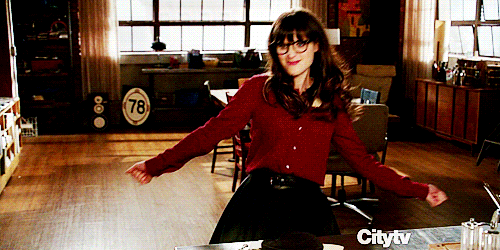

---
# Feel free to add content and custom Front Matter to this file.
# To modify the layout, see https://jekyllrb.com/docs/themes/#overriding-theme-defaults

layout: default
title:  Alexandre Bouvier
---

  <h1>Bienvenue</h1>
  
  <h2 class="text-center" style="margin: 30px;"><em>Ruby on Rails Consulting</em></h2>
  

    
Diplômé d'économie et gestion de la Sorbonne, j'ai travaillé dans de nombreuses start-ups du côte opérationnelles et il y'a 2 ans j'ai voulu apprendre à coder.

    
J'ai donc fait <a href="https://www.lewagon.com/"> Le Wagon </a> et depuis je suis développeur Ruby on Rails et travaille en free-lance sur de nombreux <a href="/portfolio.html"> projets </a> 

  

